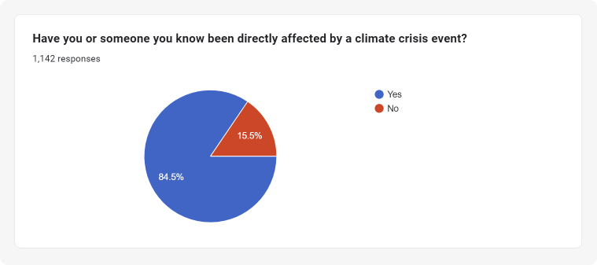
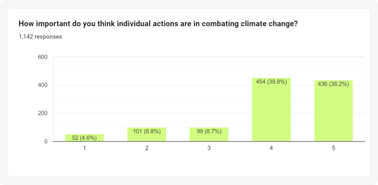
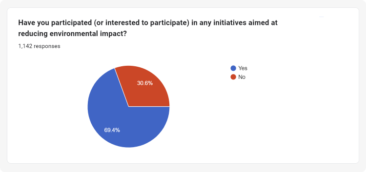
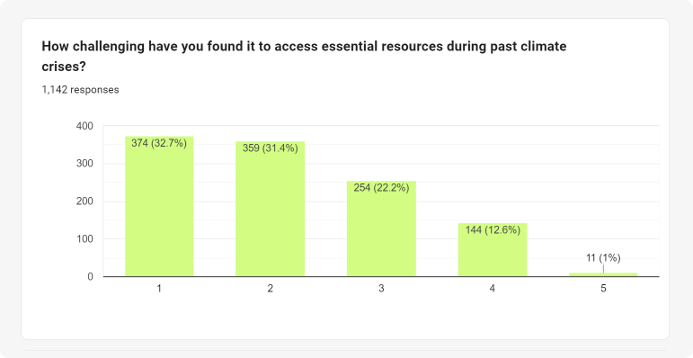
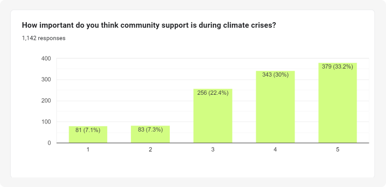
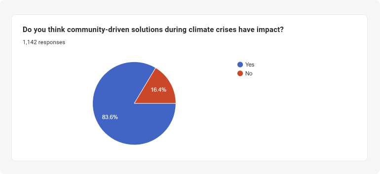
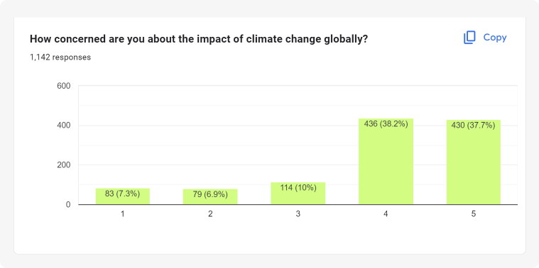
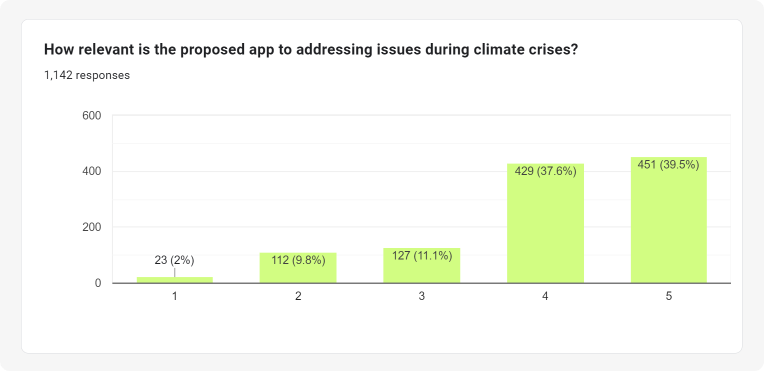
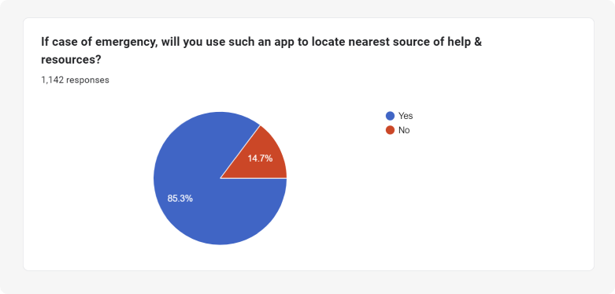

>[!NOTE]
> Any Line containing a ` ▶ ` in the start is a clickable **`Dropdown menu`**. Click on the line to expand the cascaded content
 

# <samp>Sahaya : Bridging Help in Crisis</samp>
Sahaya is an innovative disaster relief app designed to strengthen community resilience in the face of climate crises. This user-friendly platform bridges the gap between those in need of essentials and those willing to offer help during natural disasters. It's not just a tool for NGOs and emergency responders; it empowers every individual to be a part of a larger community support system. With Sahaya, preparedness, quick response, and community collaboration become the pillars of effective disaster management.

<samp>

  
 <h3> 
    
  The demographics of disasters in the **World** and in **India** 
    
  </h3> 

  
  

</samp>

<samp>

 <h2>🔮 What did we find after a research conducted with over <ins>1.1k participants</ins> ?</h2> 

We conducted an initial survey involving <kbd>1100+ responses</kbd> over <code>11 countries</code> asking their inputs and experiences. Here is an excerpt of the results:

 <h4> 👈 These were the responses </h4> 

<table>
  <tr>
    <td>  </td>
    <td>  </td>
  </tr>
    <tr>
        <td>  </td>
        <td>  </td>
    </tr>
    <tr>
        <td>  </td>
        <td>  </td>
    </tr>
    <tr>
        <td>  </td>
        <td>  </td>
</table>

> - On an average, <b> 84+ % </b> of the people were directly affected by some climate crisis.   
> - A vast section of people have faced difficulty in getting essentials during a crisis.  
> - The public opinion is that community support is the most effective way to get help during a crisis.  
> - Majority of the people are willing to help others during a crisis.  
> - People understand the importance of climate change and individual contribution to climate action.  

<h4> We also continued the survey and asked the participants to give their inputs on the app. </h4>

 <h4> 👈 Here is what we found: </h4> 

<table>
  <tr>
    <td>  </td>
    <td>  </td>
    </tr>
</table>

> - People highly believe that the app will be useful to combat crisis.  
> - People are willing to use the app to help others and to seek help.  
 

  View more of our responses @ [./assets/survey](./assets/survey)

<h3> 
  
  You too can fill in the form [here](https://forms.gle/M3ubWpjqPQrtxnkh6)! 
  
</h3>
</samp>

<samp>

  
<h2> How Sahaya Will Work (Overview) </h2>

  

</samp>

# ✨ Features
- Resource mapping
- **Will work even when Offline!** >>>  _yea you heard us right ;)_
- Predicted weather warnings and precautions   
and much more...  🤫

# 📱 Preview

<table>
  <tr>
    <td></td>
    <td></td>
    <td></td>
  </tr>
  <tr>
    <td></td>
    <td></td>
    <td></td>
  </tr>
</table>

# ⚙️ Installation

### 📝 Prerequisites:

Ensure that you have the following tools and resources installed before using Sahaya:

1. **Flutter SDK** 
2. **Android Studio** 
3. **Python 3.6+** 
4. **Gemini API** .
5. **Google Cloud Platform (GCP) Account** 
6. **Firebase** 
7. **pnpm**

### 🪴 Usage:

Follow these steps to set up and run Sahaya:

#### 1. Clone the repository:

    git clone https://github.com/sr2echa/sahaya.git

#### 2. Navigate to the project directory:

    cd sahaya

#### 3. Install Flutter dependencies:

    flutter pub get

#### 4. Update `.env`
#### 5. Open a `emulator`

#### 6. Run the application:

    turbo dev
######    or with a filter for mobile:
    turbo dev --filter=mobile

**These steps will ensure a smooth setup and execution of Sahaya on your local machine**

# Tech Stack
</samp>

# 🦄 Acknoledgements
### We are highly thankful to all those who were part of our product research and filled the form. We got more feedback, ideas & suggestions that we are actively developing!

--- 
<h6> <samp>

📜 Licensed under [MIT License](./LICENSE)  
 Made for GDSC Solution Challenge 2024 with 💖

</samp>
</h6>
