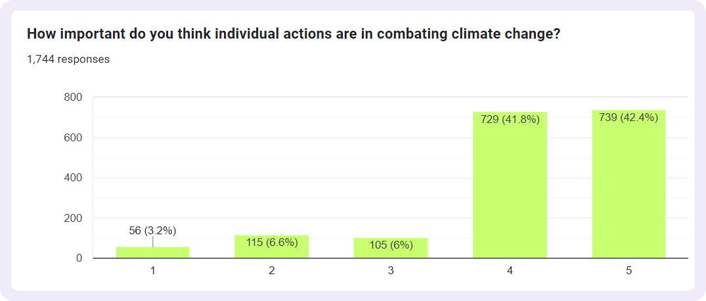
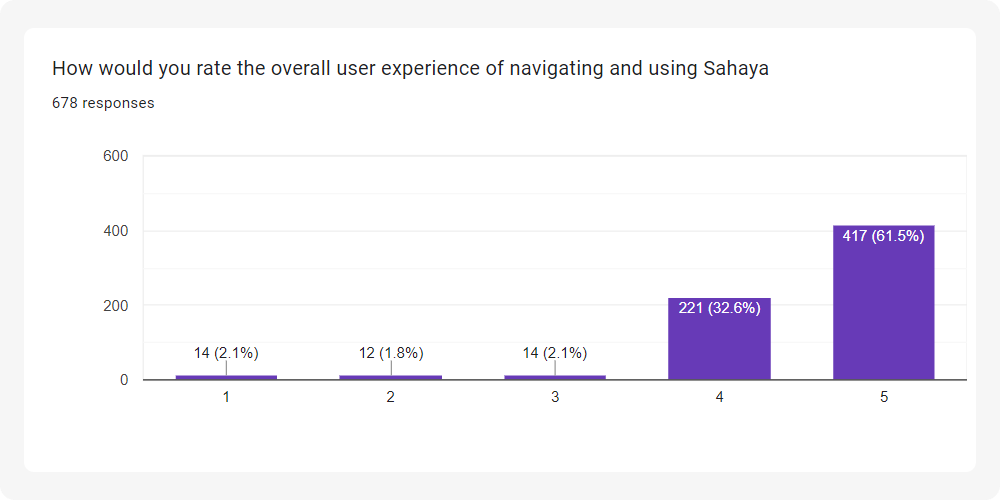
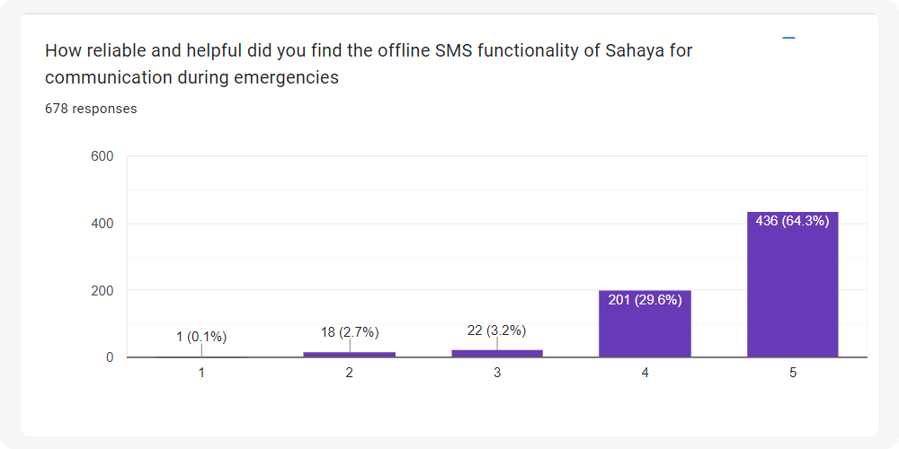

# 

Sahaya is an innovative disaster relief app designed to strengthen community resilience in the face of climate crises. This user-friendly platform bridges the gap between those in need of essentials and those willing to offer help during natural disasters. It's not just a tool for NGOs and emergency responders; it empowers every individual to be a part of a larger community support system. With Sahaya, preparedness, quick response, and community collaboration become the pillars of effective disaster management.

<samp>

> <h3><a>Feature demo of sahaya just got released! you can view it on  <a href="https://youtu.be/GQ0U3niGyw0"> YouTube</a></a></h3>

</samp>

# 

   
   

# 

<table align=center>
  <tr>
    <td width=33% style="text-align: center;">
      <h2 align=center>Sahaya</h2>
      Sahaya is an innovative disaster relief app designed to strengthen community resilience in the face of climate crises
        
      
    </td>
    <td width=33% style="text-align: center;">
      <h2 align=center>Simple Onboarding</h2>
      Simplified UI and streamlined UX makes the app intutive and seamlessly easy to use!
        
      <video src="https://github.com/sr2echa/sahaya/assets/65058816/4cb927cc-48ac-49e6-a11d-fc0a46813244">
    </td>
    <td width=33% style="text-align: center;">
      <h2 align=center>Disaster Management.   At its finest.</h2>
      With Sahaya, preparedness quick response and community collaboration becomes the pillars of effective disaster management
        
      <video src="https://github.com/sr2echa/sahaya/assets/65058816/e5c2b8f0-5402-4603-90a4-0b98737b3589">
      </td>
  </tr>
  
  <tr>
    <td width=33% style="text-align: center;">
      <h2 align=center>Your Personalized AI Weather Companion</h2>
      Stay one step ahead of disasters with personalized alerts on upcoming natural calamities and receive tailored precautions based on your location. Because being prepared is the key to saving lives.
        
      <video src="https://github.com/sr2echa/sahaya/assets/65058816/4943c7e5-d3ec-49ca-b504-f8bd6026df3b">
    </td>
    <td width=33% style="text-align: center;">
      <h2 align=center>No internet? No problem! </h2>
      Sahaya works seamlessly offline, ensuring real-time data on nearby assistance needs and offerings. Be a helping hand, anytime, anywhere. Thanks to our sms-as-an-api for making it possible :)
        
      <video src="https://github.com/sr2echa/sahaya/assets/65058816/f408497f-dfa5-49ca-933b-fb34372be94a">
    </td>
    <td width=33% style="text-align: center;">
      <h2 align=center>Dedicated SOS functionalities</h2>
      With just a tap, you can instantly alert your emergency contacts, ensuring swift assistance and prioritizing your safety above all else. When disaster strikes, count on Sahaya as your lifeline.
        
      <video src="https://github.com/sr2echa/sahaya/assets/65058816/1f84699b-4b19-4aa4-b5b3-409a19e49a54">
    </td>
  </tr>
</table>

# 

<table>
<tr>
<td width=48.5%>

## 📝 Prerequisites:

Ensure that you have the following tools and resources:

1. **Flutter SDK** 
2. **Android Studio** 
3. **Python 3.6+** 
4. **Gemini API**
5. **Google Cloud Platform (GCP) Account** 
6. **Firebase** 
7. **pnpm**
8. **Twilio API**
9. **Novu API**
- text-editor of your choice
- emulator / debug device

   

## 🔮 Minimum Requirements
- 2GB Storage
- 8GB RAM
- Intel Pentium + 
- Windows 7+ (or) Mac OSX 8+

</td>
<td width=48.5%>

## 🪴 Usage:

#### 1. Clone the repository:

    git clone https://github.com/sr2echa/sahaya.git

#### 2. Navigate to the project directory:

    cd sahaya

#### 3. Install Flutter dependencies:

    flutter pub get

#### 4. Update `.env` (in both /mobile & /flask)
#### 5. Open a `emulator`

#### 6. Run the application:

    turbo dev
######    or with a filter for mobile:
    turbo dev --filter=mobile
    
</samp>
 
</td>
</tr>
</table>

  
# 

> [!IMPORTANT]  
> Your can view the responses and all the Data Points from both the surveys @ [assets/survey](https://github.com/sr2echa/sahaya/tree/main/assets/survey). 

 

  
<h3>Expand to know more</h3>
  

  We Conducted 2 Survays - to understand the market & other to get app feedback from users

  We did a market **analysis** consisting of more than **1700+ respondents** across **11+ countries** and various backgrounds. Dispite the diverse set of people, most of them wanted a community powered platform for disaster management. 
  
  Then we conducted a **feedback** survey involving more than **600+** closed beta testers (friends & family) who shared their experiece and rated the app's features. 

  Here are some of the major highlights :
  

<h3>I . Idea Research </h3>

  <samp> You can fill the form [here](https://forms.gle/KoA4SV8erNCw24d77) </samp>   
  <table>
    <tr>
      <td></td>
      <td></td>
    </tr>
    <tr>
      <td></td>
      <td></td>
    </tr>
    <tr>
      <td></td>
      <td></td>
    </tr>
  </table>
  

<h3>II. Feedback Survey</h3>

<samp> You can fill the form  [here](https://forms.gle/Z1MXJMBpVcQv9BhY9) </samp>   

  <table>
    <tr>
      <td></td>
      <td></td>
    </tr>
    <tr>
      <td></td>
      <td></td>
    </tr>
  </table>

 

<table>
  <tr>
    <td>
      <video src="https://github.com/sr2echa/sahaya/assets/65058816/362482bb-b6e0-478f-bdf3-32287c2baf06">
    </td>
    <td>
      
    </td>
  </tr>
</table>

# 

> We are highly thankful to all those who were part of our product research. We got tons of feedback, ideas & suggestions that we are actively developing and many of which we put into effect!

> Special thanks to [Vikranth](https://www.instagram.com/vikranth_jagdish) for helping with the video.

> We'd also like to thank our testing group who helped shape our application.

--- 
<h6> <samp>

📜 Licensed under [MIT License](./LICENSE)  
 Made for GDSC Solution Challenge 2024 with 💖

</samp>
</h6>
